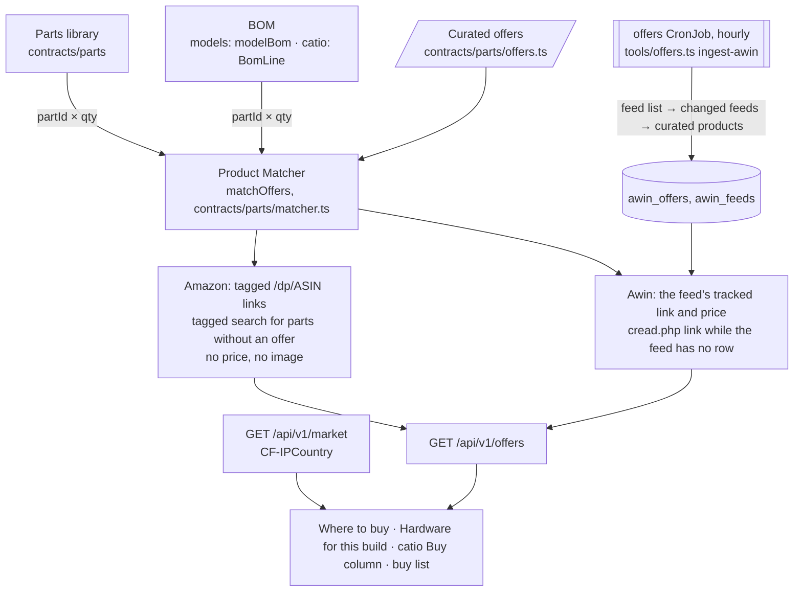

# Affiliate offers and the buy list

CanFactory links the real-world parts its models are made to fit to shops: **Amazon** (Associates, amazon.de and amazon.com)
and the advertisers of **Awin**, an affiliate network. Every part of the parts library, the hardware of every model and
the parts lists of the catio pages link to their best offer in the visitor's market, and visitors gather a **buy list**
across models. Background, the networks' rules and the decisions behind this page are in issues #53 and #54.

## Accounts

`packages/contracts/src/parts/affiliateAccounts.ts` holds the Amazon tracking ids per market and the Awin publisher id.
They are public (every link shows them). **A `null` account turns its network off**, and with every account `null`, as
shipped, no affiliate link appears anywhere: no offer block, no buy-list link in the header, no Buy column.

- Amazon: sign up for Associates on **amazon.de** (PartnerNet) and **amazon.com** separately, and set `amazon.DE` and
  `amazon.US` to the tracking ids. Each account is reviewed only after **3 qualifying sales within 180 days**, and is
  closed otherwise, so sign up when the links are about to go live.
- Awin: set `awin.publisherId`, join the advertisers whose products are curated, and create the `canfactory-offers`
  Secret for the feed job (below).

## Curated offers

`packages/contracts/src/parts/offers.ts` is the Product Matcher's data: listings checked by hand against the part they
sell, one row per market (an ASIN of amazon.de is not necessarily the same product on amazon.com: `B07YSV66Y5` is
ruthex's M4 insert on amazon.de and its ¼″ insert on amazon.com).

- `covers` lists the library parts one pack holds and how many: one size of insert, or every size of an assortment box.
- `rank` orders the offers of a part, lowest first. `sameAsProduct` marks the listing of the part's own manufacturer
  product: its link replaces the parts library's plain “Product page” link.
- Amazon offers name an `asin`. Awin offers name the `advertiserId`, the `shop` as visitors see it, the product's
  `merchantProductId` in the advertiser's feed, and its `productUrl` (for the tracked link while the feed has no row).
- `checkedOn` and `note` say when and how the listing was checked, as part sources do.

Never put a price in this file: Amazon allows prices only from its API (out of scope, see #54), and Awin's come from its
feeds at run time. `offers.test.ts` checks every offer's schema, that its parts are permanent library ids, and that no
listing is curated twice per market.

A part without a curated offer in the market links to a search of that market's Amazon for its designation (or its
manufacturer and article number).

## The matcher and the API

`matchOffers(requirements, market, …)` (`contracts/parts/matcher.ts`) sums the requirements by part. For each part it
returns the curated offers of the market's networks that have an account, with the packs that cover the quantity, best
first. An Awin offer that is out of stock, or whose price is unknown or older than 72 hours, sorts last. `shops` is the
buy list: the best offer of each part, grouped by shop. A pack that covers several parts (an assortment) is bought
once, in enough packs for all of them.

- `GET /api/v1/market`: the visitor's market from Cloudflare's `CF-IPCountry` (DE, AT and CH shop in `DE`; every other or
  unknown country in `US`) and the networks that link per market. The country is not stored. Vercel previews send `/api`
  to production through Vercel, so their country is Vercel's; the market selector covers that.
- `GET /api/v1/offers?market=DE&parts=ruthex-rx-m3x5-7:4,iso-4762-m3x10:8`: the matcher's result, with the stored Awin
  rows merged in. Cached for five minutes.

## Awin feeds: the offers service

`tools/offers.ts ingest-awin` (`npm run offers:ingest -- --now` locally, the `offers` CronJob in Kubernetes) stores the
feed rows of the curated Awin products (`packages/server/src/awin.ts`):

1. Waits 10 s to 2 min, as Awin asks of scheduled jobs (skipped with `--now`).
2. Downloads the product feed list (`productdata.awin.com/datafeed/list/apikey/<key>`) with `AWIN_DATAFEED_KEY`, Awin's
   *product feed* key (not its API token).
3. For each advertiser with curated offers, downloads every feed whose “Last Imported” is newer than the stored one,
   streams the CSV, keeps the rows of the curated `merchant_product_id`s, and replaces what that feed held before
   (`awin_offers`, `awin_feeds`; migrations `0002_awin_offers.sql`). Each feed is fetched at most once per run, within
   Awin's limits (≤ 5 concurrent and ≤ 5 duplicate downloads per hour).
4. Retries a failed download once after 5 minutes, and logs curated products missing from their advertiser's feeds:
   those link without a price.

The CronJob (`charts/canfactory/templates/offers.yaml`) is **suspended by default**. Enable it with `offers.suspend=false`
once the `canfactory-offers` Secret holds `AWIN_DATAFEED_KEY` and the network policy allows egress to
`productdata.awin.com` and `datafeed.api.productserve.com` on 443.

## What the visitor sees

- **Parts library**: “Where to buy” under a part's details lists its offers, with a market selector and “Add to buy list”.
- **Model editor**: “Hardware for this build” lists the library parts of the model's assembly for the current settings
  (`modelBom`: its reference objects and linked references, counted by part) with their best offer. This is derived
  only: a model that places no hardware in its assembly preview shows none.
- **Catio pages**: the parts list gets a Buy column for its library parts and “Add all hardware to buy list”.
- **Buy list** (`#/buy-list`): everything added, summed by part, rounded up to packs and grouped by shop, with the
  quantities editable. It is kept in this browser's localStorage (`canfactory.buy-list`), as is the chosen market
  (`canfactory.market`).
- Every offer block carries the affiliate note and links to `#/disclosure`. The footer links to `#/disclosure` and
  `#/privacy`.

## Rules that must hold

- Amazon: never a price, availability or image. Links are used as built (`/dp/<ASIN>?tag=…`), never edited. The
  disclosure is shown clearly: “Als Amazon-Partner verdiene ich an qualifizierten Verkäufen.” / “As an Amazon Associate
  I earn from qualifying purchases.”
- Awin: the feed's data is reproduced faithfully. A price is shown with VAT included (DE), a shipping note, and the time
  Awin imported the feed. It is hidden 72 hours after that import, while the link stays.
- Every affiliate link has `rel="sponsored noopener"` and opens in a new tab. No third-party script (no Awin MasterTag):
  CanFactory sets no cookies of its own.

## Amazon's Add-to-Cart form

`amazonCartUrl` builds Amazon's Add-to-Cart form (`/gp/aws/cart/add.html?ASIN.1=…&Quantity.1=…&AssociateTag=…`), which
would put a whole shop group into the basket in one click. It is documented only in the retired PA-API 5 docs. Checked
on 2026-10-06 without an access key, both amazon.de and amazon.com still answer it: they redirect to Amazon's sign-in,
which returns to `/associates/addtocart` with the items and the tag. Whether the purchase is then credited to the
tracking id can only be checked with an Associates account. Until then `AMAZON_CART_FORM_VERIFIED` is `false` and the buy
list links each item. Set it to `true` once a test purchase shows up in the Associates reports.
