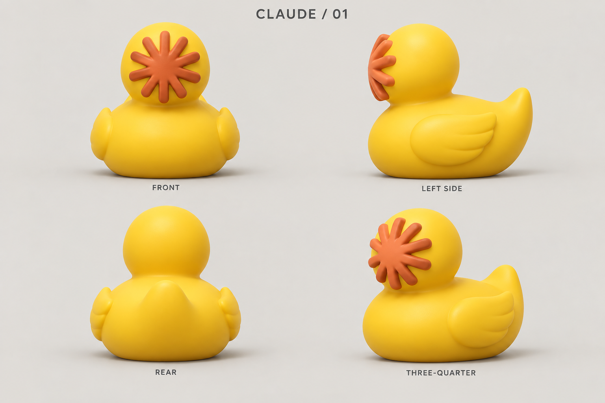
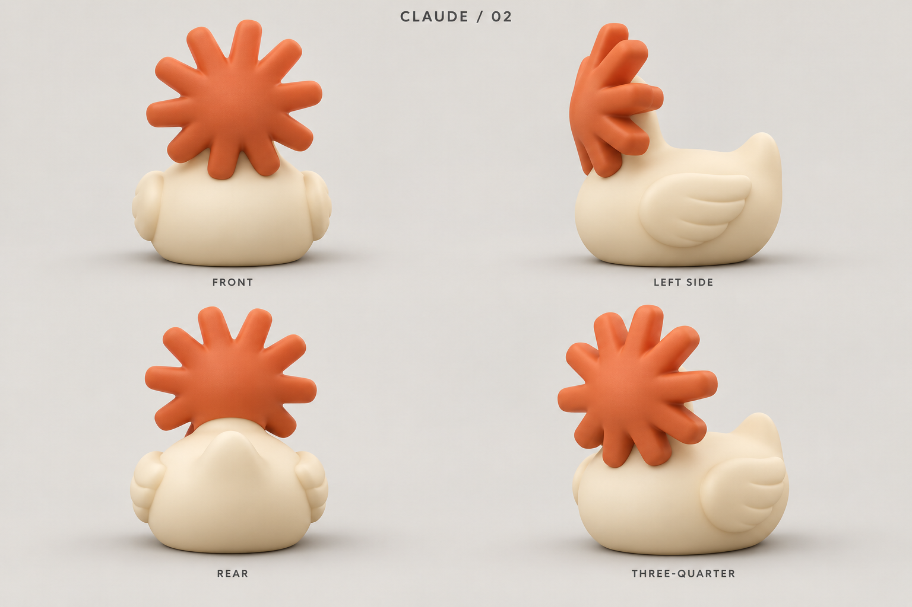
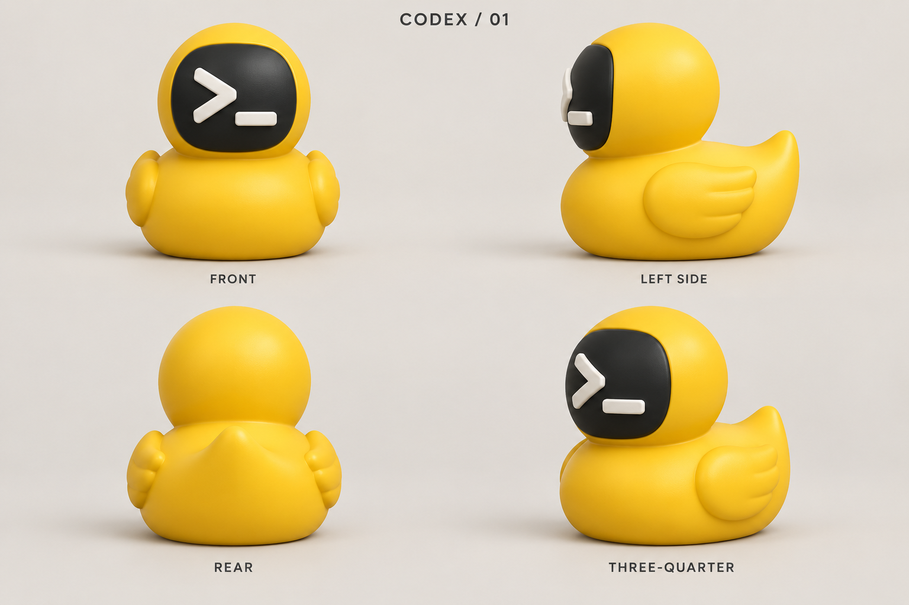
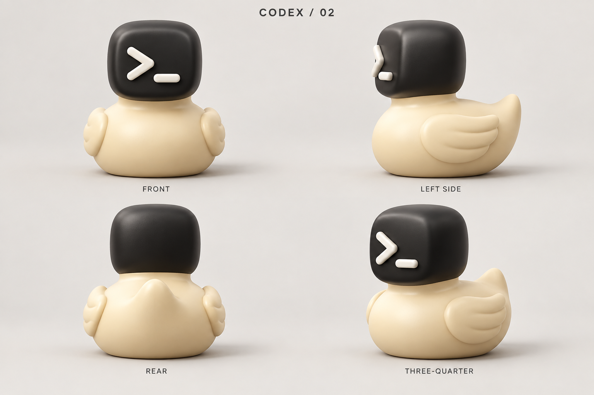
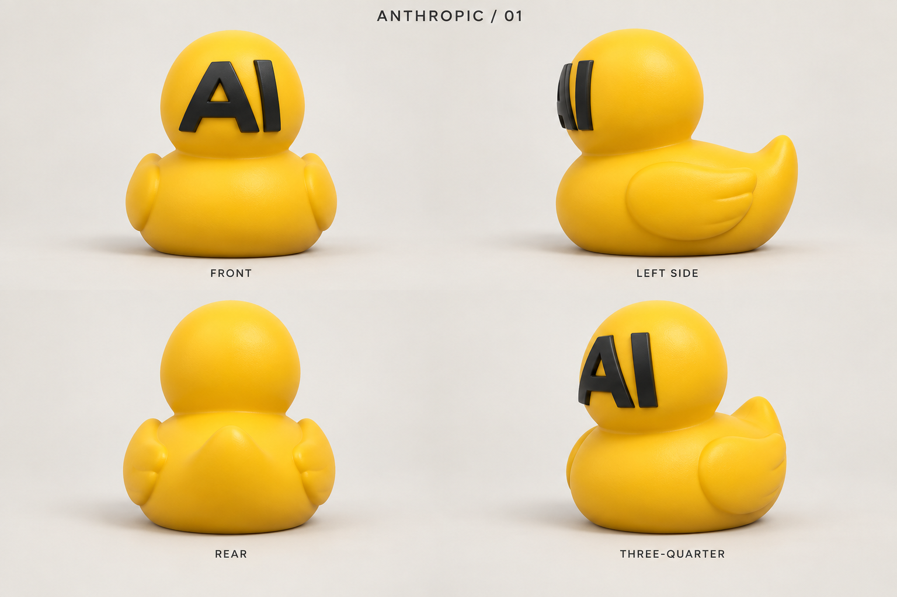
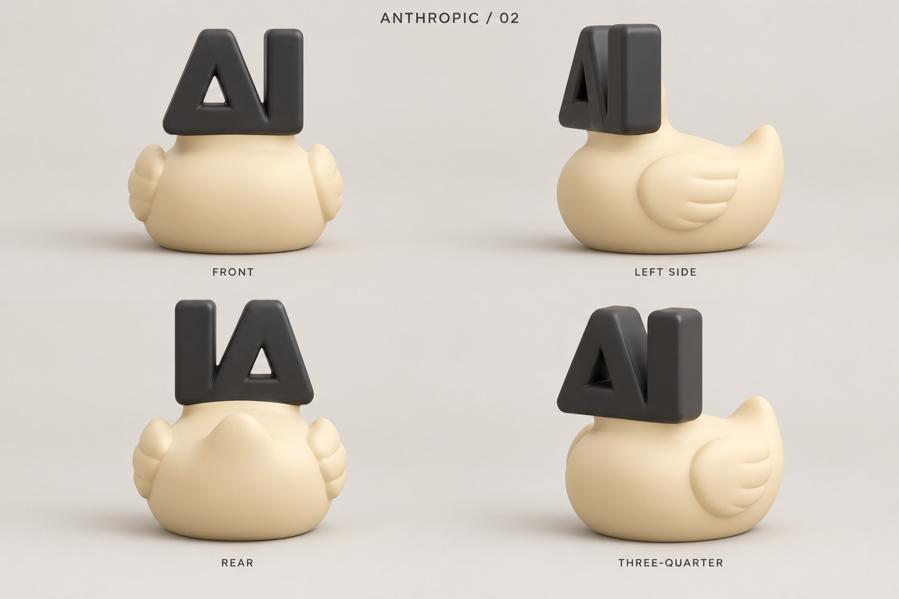
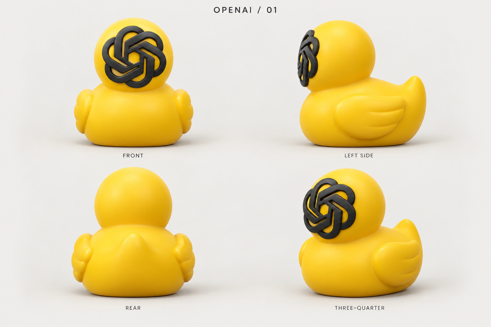
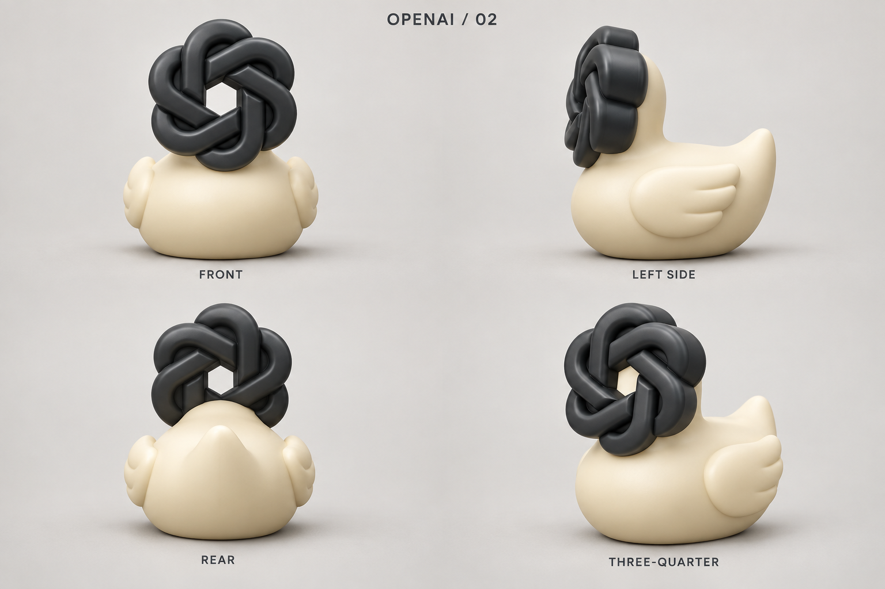

# AI rubber duck concepts

Rubber duck debugging meets AI pair programming: the familiar duck body with a
Claude, Codex, Anthropic, or OpenAI face. These PNG sheets explore the design
before creating an OpenSCAD model. All eight are now available in the
[AI rubber duck model](../../ai-rubber-duck.md), with separate printable pieces,
assembly instructions and views rendered from the actual STL files.

Each brand has two versions, each shown from the front, left side, rear, and
front three-quarter angle:

- **01 — Round:** yellow duck with a rounded head and raised symbol face.
- **02 — Sculpted:** cream duck with a head shaped around the brand symbol.

The face replaces the conventional duck eyes and bill. Claude uses a terracotta
starburst; Codex uses a terminal-inspired `>_` face; Anthropic uses an `AI`
monogram; OpenAI uses an interwoven knot. These are unofficial design
interpretations, not production brand assets.

## PNG gallery

| Brand | 01 — Round | 02 — Sculpted |
| --- | --- | --- |
| Claude |  |  |
| Codex |  |  |
| Anthropic |  |  |
| OpenAI |  |  |

Open a PNG for the full-resolution 1536 × 1024 sheet. Each sheet contains four
views of one concept, giving eight versions and 32 views across the collection.

## OpenSCAD interpretation

These remain the visual references. Generated views can have small geometric
differences and are not dimensioned engineering drawings. The implementation
adds flat print surfaces, keyed push-fit pegs and flat seats while retaining
the flat belly, rounded wings, head silhouettes and color-separated pieces.
The shared body's proportions were measured from the Claude · 01 side and front
views (scaled to a 90 mm body length). Round faces are modeled as rounded inlays
that follow the head's curve; sculpted heads are sized from their sheets and
rest directly on the shoulders.

## Generation

Created with the imagegen skill and built-in `image_gen` tool. Each sheet was
generated separately on an opaque studio background. The exact prompt for each
file is recorded in [prompts.md](prompts.md).

Brand context: [Claude](https://claude.com/),
[Codex](https://openai.com/codex/), [Anthropic](https://www.anthropic.com/), and
[OpenAI design guidelines](https://openai.com/brand/).
