# Window catio concepts

A ground-supported timber enclosure connects a souterrain apartment window to the lawn. A removable collar clamps into the solid exterior recess and can be tightened by reaching through the open window. The existing sash opens inward and can close with the attachment installed. Four short legs support the timber base; a continuous metal-mesh floor and low mesh skirts enclose the grass. A narrow cleated ramp descends from the sill.

## Design gallery

Each image opens as a full-resolution 1536 × 1024 PNG. These are design references for review and later SCAD work. Generated illustrations can differ in perspective, hinge placement and small construction details; the dimensions below and the live geometry take precedence. Hardware is schematic, pending measured recess dimensions and detailed sizing.

| Study | Image |
| --- | --- |
| Exterior and interior overview | [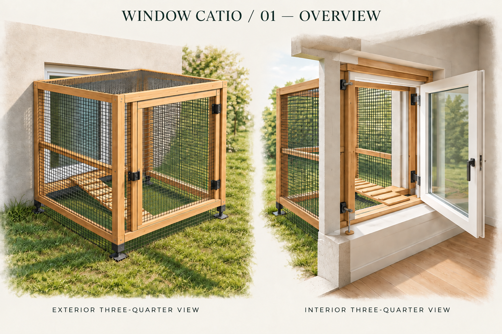](01-overview.png) |
| Front, side and top orientations | [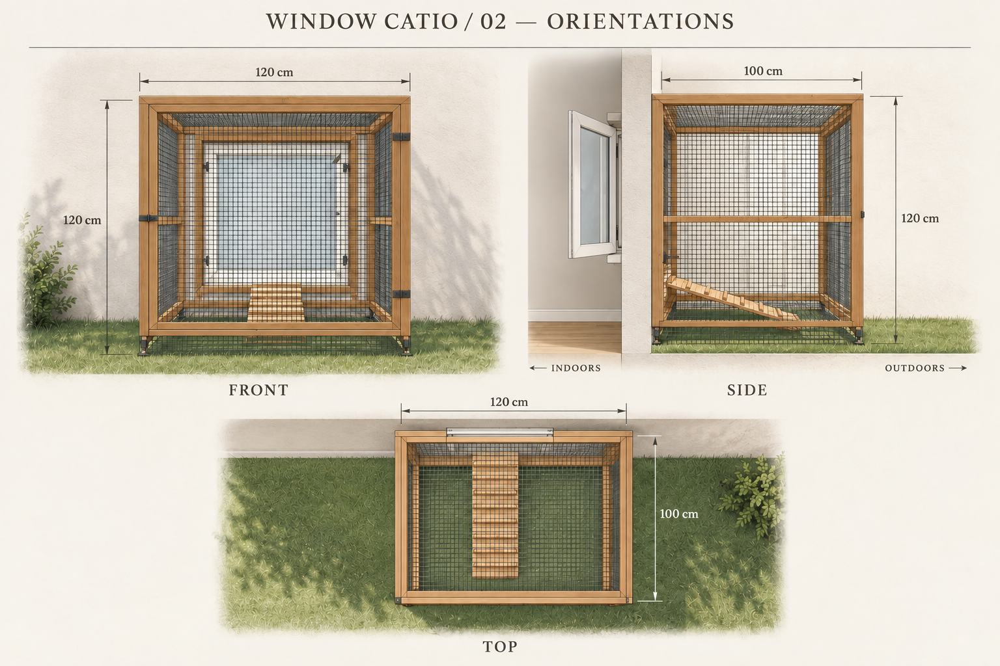](02-orientations.png) |
| Interior adjustment, exterior connection and clearance section | [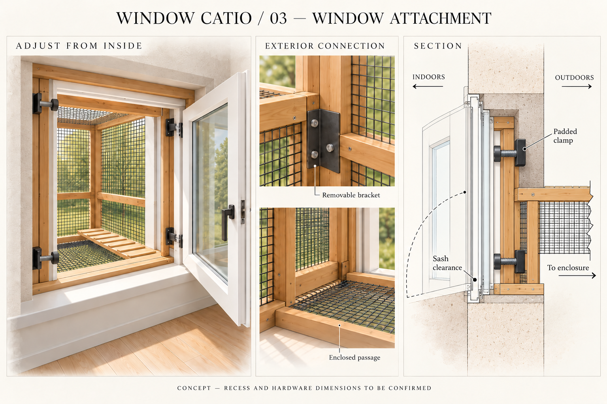](03-window-attachment.png) |
| Legs, ramp, mesh floor and grass | [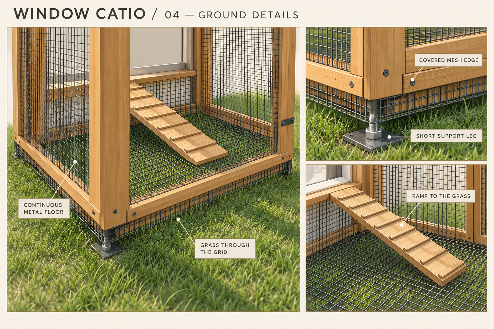](04-ground-details.png) |
| Exploded components | [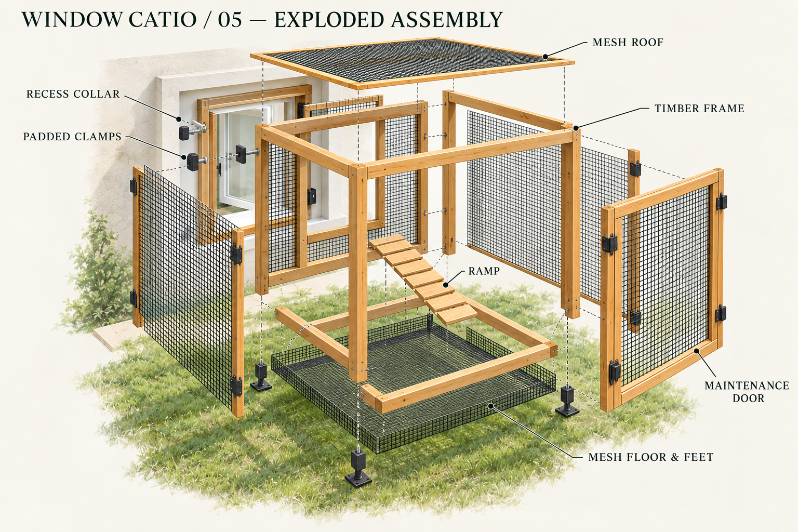](05-exploded.png) |
| Six assembly stages | [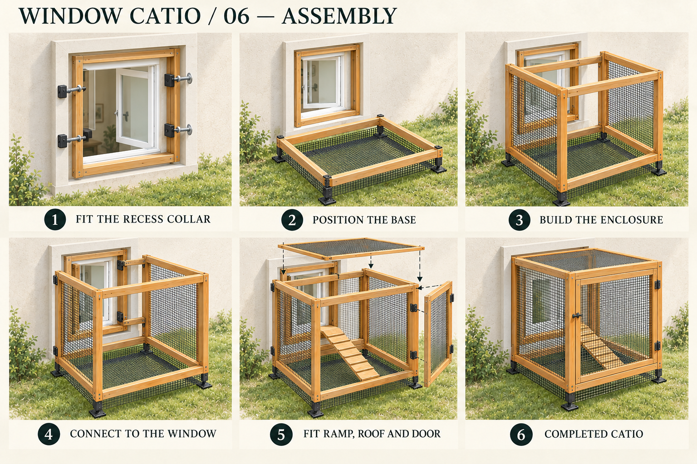](06-assembly.png) |

Created using the imagegen skill and built-in image tool. The [exact prompts and corrections](prompts.md) record how the sheets were made from inspected browser screenshots.

## Live concept

Open **Catio concept** in the CanFactory header or the **Window catio** card in the model library: `#/concepts/catio`.

For local development:

```sh
npm run dev --workspace @canfactory/web -- --port 5181
```

Then open <http://127.0.0.1:5181/#/concepts/catio>. This page works without an API or worker. The existing app may still request catalogue metadata for its navigation, but failures do not block the concept.

The preview provides six camera presets, orbit/pan/zoom, a window open/closed toggle, wall cutaway, exploded view, component visibility, and a six-stage assembly slider. The gallery and written assembly instructions remain available when WebGL is unavailable. Images can be opened or downloaded individually.

## Window insert

The window insert has its own live page, `#/concepts/catio/window-insert`, linked from the page heading: its pieces, parametrised timber joints, mesh fixing
and the no-drilling clamps, a staged assembly and a parts list, for both designs. See [window-insert.md](window-insert.md).

## Insert–tunnel coupling

The joint between the window insert's cat port and the tunnel's first flange has its own live page,
`#/concepts/catio/insert-tunnel-coupling`: a docking frame screwed to the insert, a squashed seal and a floor lip, and Ganter
GN 831 toggle latches that dock and undock the tunnel without tools. The tunnel's wall support still carries all of its
weight. See [window-insert-tunnel-coupling.md](window-insert-tunnel-coupling.md).

## Tunnel

The tunnel has its own live page, `#/concepts/catio/tunnel`: the route solved from the window insert's cat port to the
enclosure's port at any position, facing and floor height, turns and climbs at any angle through parametrised angle joints,
and supports on levelling feet for uneven ground, with a staged assembly, a parts list and presets (straight, 90° turn right,
rising). See [tunnel.md](tunnel.md). The
modular whole-catio scene keeps its schematic straight and 90° modules on level feet until the tunnel page's design is adopted
there.

## Tunnel–tunnel coupling

How two of the tunnel's sections are joined has its own live page, `#/concepts/catio/tunnel-tunnel-coupling`: one section
built and laid on the support under the joint, its joint readied, then a second, identical section coming in along the
tunnel's axis and coupled to it. Printed toggle latches across a sealed 3 mm gap by default, M8 bolts through both flanges as
an option. The tunnel page couples every section and angle collar this way; mitred joints and the enclosure end stay
bolted. See [tunnel-tunnel-coupling.md](tunnel-tunnel-coupling.md).

## How the sub-assembly pages fit each other

The tunnel and the insert–tunnel coupling are fitted to the window insert, and the coupling also shows the tunnel. The tunnel
follows the tunnel–tunnel coupling's mechanism at every coupling, and that page is built from the tunnel's sections, support
and feet in turn. Each page reads the others' saved settings. One declaration on the dependent page, `follows` in
[catioSubassemblies.ts](../../../apps/web/src/catioSubassemblies.ts), lists the settings of the other page that change it,
and everything else is derived from it ([CatioCrossPage.tsx](../../../apps/web/src/CatioCrossPage.tsx)):

- Both briefs link the two pages: "It fits the …" on the dependent page, and "The … are fitted to this one" on the other.
- Under every followed setting, the other page says what else it changes ("Also changes the tunnel and the insert–tunnel
  coupling.").
- When saved settings on one page break a page fitted to it, the page being edited lists that page's errors with a link.
  The catio concept page does the same for all sub-assemblies, since they take the window and cat port sizes from it.
- A page can also show and set another page's settings itself (`shares`): the owning page's saved settings hold them, the
  sharing page reads them from there when it opens and writes them back when they change, and both pages say so. The
  tunnel–tunnel coupling page shares the tunnel's **Held on the supports by** and **Supports stand** this way.
- A fact or a design decision can name the other page's settings it comes from (`from`). The page then shows "Set on the …
  page: …" under it, e.g. the coupling's cover battens and the tunnel's window port floor.

A test changes every window insert setting in turn and checks that exactly the declared ones change each dependent page; it
does the same between the tunnel and the tunnel–tunnel coupling, in both directions.

Geometry that one page owns and another shows is drawn by one builder: `buildInsertContext` (the installed insert),
`buildCouplingPieces` (the docking frame, seal, catches, latches and lip), `buildSectionPieces`, `buildSupportPieces` and
`buildCouplingJoint` (the tunnel's sections, supports and flange couplings, in
[catioTunnelPieces.ts](../../../apps/web/src/catioTunnelPieces.ts)), and `buildPrintedLatches` (the printed toggle latch, on
both coupling pages and the tunnel, placed by [catioPrintedLatch.ts](../../../apps/web/src/catioPrintedLatch.ts)). Fasteners added on top of another page's are
placed with `clearOf` and checked with `fastenerClashes` ([catioSubassembly.ts](../../../apps/web/src/catioSubassembly.ts)).

## Dimensions and assumptions

| Item | Value | Basis |
| --- | --- | --- |
| Glass | 800 × 800 mm | User measurement |
| Movable sash | 910 × 910 mm | User measurement; excludes fixed frame |
| Sill above grass | 200 mm | Illustrative assumption; confirm on site |
| Enclosure, width along wall × projection × height above grass | 1200 × 1000 × 1200 mm | Selected concept size |
| Fixed window frame | 1000 × 1000 mm | Illustrative estimate |
| Wall thickness / exterior recess depth | 300 / 150 mm | Illustrative estimates |
| Timber members | 45 × 45 mm | Concept default |
| Mesh openings / wire thickness | Nominal 20 / 2 mm | Concept defaults |
| Floor mesh plane | 4 mm above lawn datum | Concept depiction of mesh touching grass |
| Ramp width / horizontal run | 300 / 700 mm | Concept defaults |
| Hinges | Left, viewed from indoors | Assumed orientation |

The model uses millimetres, X along the wall, +Y outdoors and Z up. Grass is Z=0 and the exterior wall face is Y=0. The collar and its four padded side clamps sit entirely beyond the closed sash. The timber rear portal is connected with removable exterior brackets and a mesh-sided passage with a timber threshold. Mesh surrounds the rear portal and covers the other sides, roof and floor. Covered edges and a low perimeter skirt join the floor to the raised base rails. The garden-facing maintenance door is timber and mesh, with hinges and a latch.

The geometry, dimensions and assembly stages live in [catioDesign.ts](../../../apps/web/src/catioDesign.ts) and [catioScene.ts](../../../apps/web/src/catioScene.ts). Measured recess size, hardware fit and structural sizing need to be established before fabrication. The current stage has no SCAD files or printable export. Modular mode adds editable dimensions; the original direct design stays fixed.

## Assembly sequence

The existing window, wall and grass remain stationary. The window is existing context, not a new window installation.

1. **Fit the recess collar:** open the sash inward and tighten the four padded clamps from inside.
2. **Position the base:** set the feet on the lawn and secure the continuous mesh floor and low perimeter skirt.
3. **Build the enclosure:** assemble the posts, upper rails and side mesh panels.
4. **Connect to the window:** attach the rear portal, enclosed passage and removable brackets.
5. **Fit ramp, roof and door:** install the cleated ramp, mesh roof and maintenance door.
6. **Completed catio:** latch the door and inspect the original window in its open and closed positions.

## Verification

Unit tests inspect the actual procedural geometry for glass/sash dimensions, enclosure bounds, floor/skirt continuity, ramp endpoints, stationary context and clearance throughout a 0–90° sash sweep. This checks the illustrative scene, not structural capacity or the fit of an unmeasured real window.

Browser tests cover the concept with unavailable backend services, camera controls, assembly stages, visibility, window state, both six-sheet galleries and image downloads, history navigation and mobile WebGL fallback. Run:

```sh
npm run check
npm run build
BASE_URL=http://127.0.0.1:5181 npx playwright test tests/browser/catio.spec.ts
```


## Modular option

Switch **Direct · original design** / **Modular · with tunnel** above the preview. Direct remains the initial default. Gallery filters independently show All, Direct or Modular. All twelve full-resolution PNGs are bundled locally, including in production builds.

Modular mode provides separate glass and sash width/height controls, enclosure A dimensions, tunnel clear width/height, straight/left/right routing and module counts. An optional enclosure B has independent dimensions and a straight side link to A. Each mode retains its camera preset, assembly position, layer choices and door states. Valid dimensions and viewing settings persist in local storage. Invalid edits show an inline explanation and leave the last valid scene visible. **Reset modular dimensions** restores the original modular sizes and straight route.

| Modular study | Image |
| --- | --- |
| Exterior and interior overview | [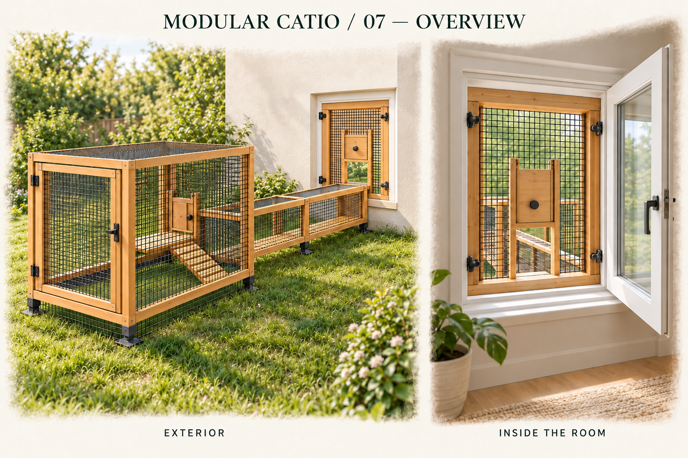](07-modular-overview.png) |
| Front, side, top and three-quarter orientations | [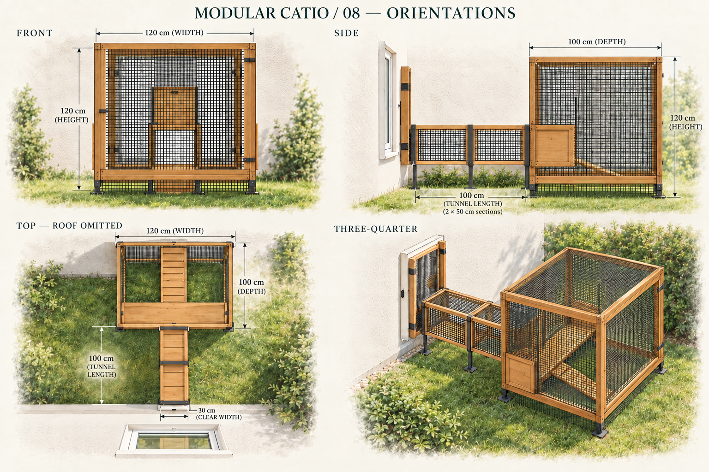](08-modular-orientations.png) |
| Window adapter, gate and removable docking | [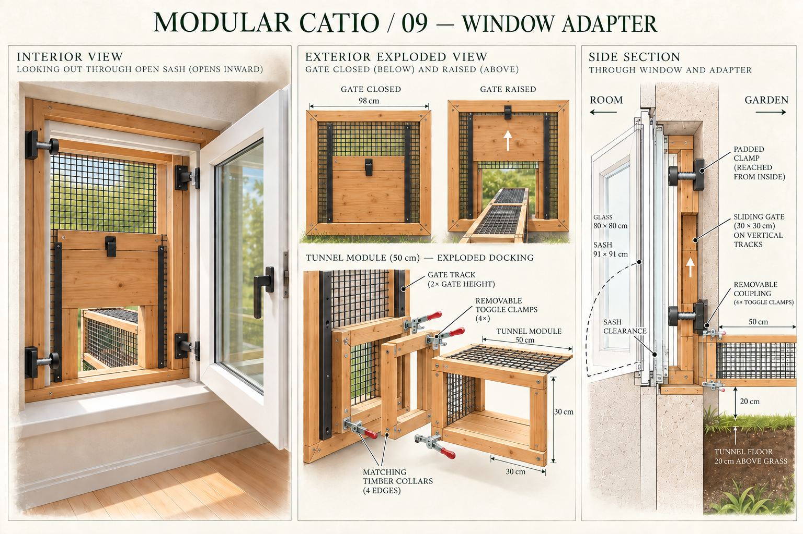](09-modular-window.png) |
| Human maintenance doors and cat gates | [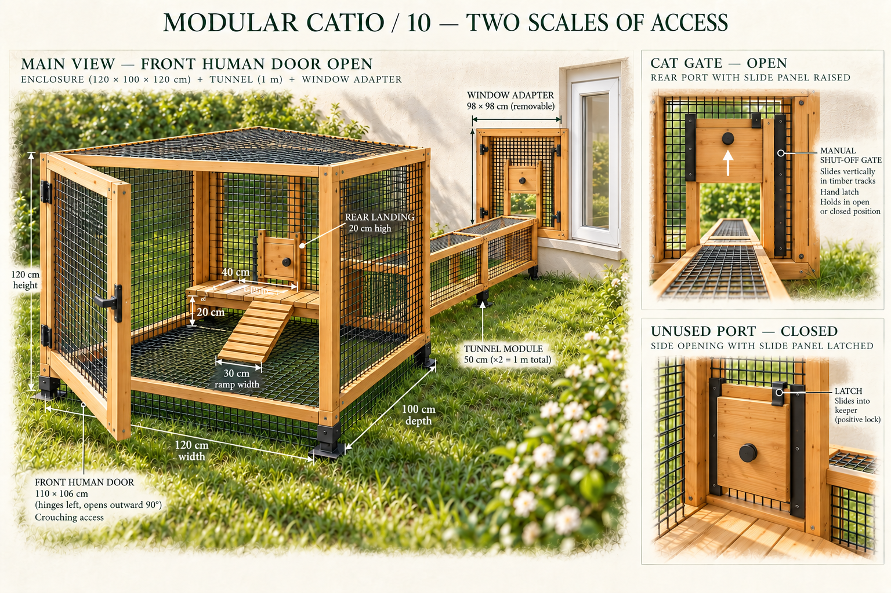](10-modular-access.png) |
| Offset routes and linked enclosures | [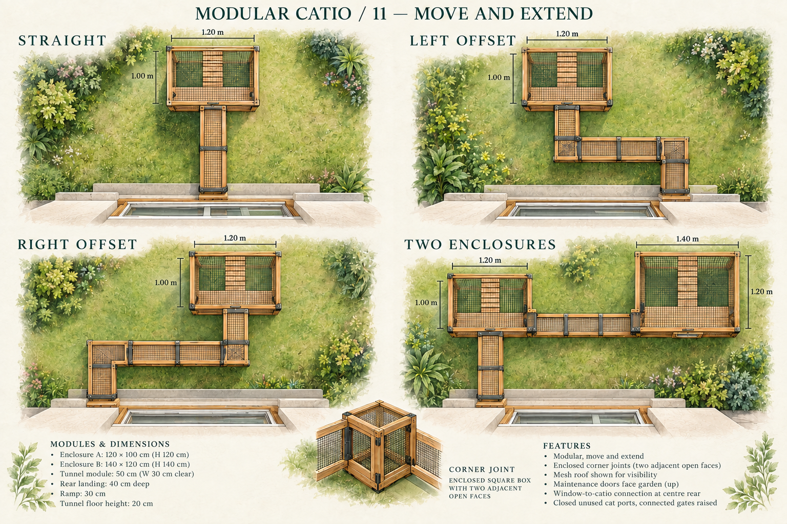](11-modular-layouts.png) |
| Assembly and disconnection | [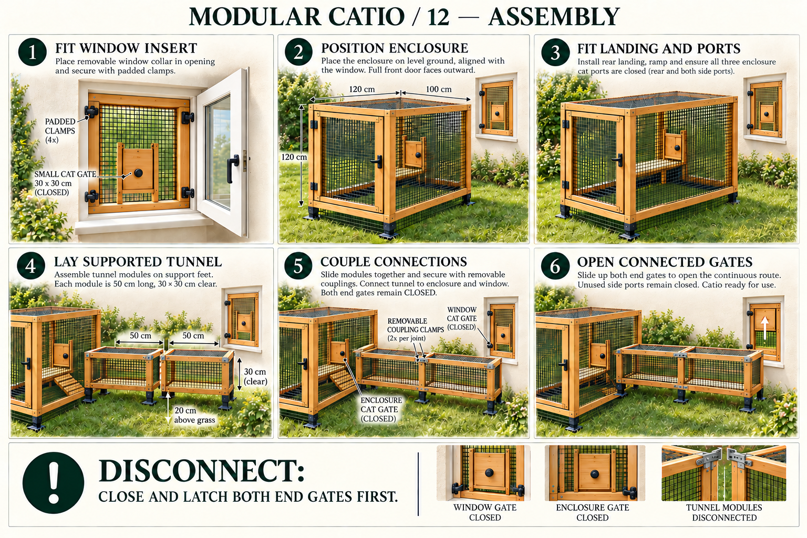](12-modular-assembly.png) |

The [exact modular prompts and correction passes](modular-prompts.md) record use of the built-in image tool. Original sheets 01–06 are unchanged. The revised orientation and route artwork also uses inspected offline projections of the actual geometry: [orientations](reference/modular-orientations.png) and [layouts](reference/modular-layouts.png). Top projections omit mesh to expose the route, landings and ramps. These are supporting geometry references, not browser screenshots. Generated art remains schematic; numeric geometry defines the fit and route.

### Parameters and depicted configurations

| Parameter | Default | Allowed values |
| --- | --- | --- |
| Glass width / height | 80 / 80 cm | 40–140 cm each |
| Sash width / height | 91 / 91 cm | 50–160 cm each; at least 3 cm border around glass |
| Each enclosure W / D / H | 120 / 100 / 120 cm | W and D 80–240 cm; H 90–220 cm |
| Tunnel clear W / H | 30 / 30 cm | 20–45 cm each, subject to gate and ramp clearance |
| Straight module length | 50 cm | Fixed |
| Approach modules | 2 | 1–6 |
| Offset lateral / final modules | 2 / 1 | 1–6 each; two corner modules added automatically |
| Second-enclosure link modules | 2 | 1–6 |
| Window and tunnel floor above grass | 20 cm | Fixed concept assumption |
| Modular frame members | 40 mm | Fixed concept assumption |
| Fixed-frame allowance | 45 mm per side of sash | Fixed concept assumption |
| Collar outside dimensions | Sash dimensions + 70 mm | 10 mm margin inside fixed frame per side |

Sheets 07–10 and 12 depict the default one-enclosure straight configuration. Sheet 10 opens the human maintenance door; each connected cat gate can be opened or closed independently. Sheet 11 compares the default straight layout, mirrored offsets with one approach + two lateral + one final straight modules, and two enclosures. In its two-enclosure example B is 140 × 120 × 140 cm; A stays 120 × 100 × 120 cm, with a two-module side link. Corner modules have an outside square footprint equal to tunnel clear width + 80 mm, so a two-module lateral run shifts the enclosure by 138 cm at the default width.

### Connections and access

The original large window passage is replaced, in modular mode, by mesh infill and a small sliding gate at the bottom of the removable collar. Window and enclosure ports share the tunnel's clear dimensions. Timber collars, shallow metal flanges and schematic removable clamps show the docking interfaces; these are conceptual hardware, not fabricated part specifications. The window insert is tightened from inside; tunnels and enclosure couplings are assembled outside. All installed geometry clears the inward sash sweep.

Tunnels have solid timber floors, mesh sides and roof, and short supports at section ends. Straight and 90° corner modules form a continuous enclosed route at sill height. Enclosures have a continuous grass-level mesh floor, four short supports and low mesh skirts. A full-width rear landing meets rear and side cat ports; one cleated ramp descends toward the front inside each enclosure. Different enclosure depths share the same rear edge and side-port location, leaving the human doors free.

Each enclosure has a full-front outward hinged maintenance door. At the default 120 cm enclosure height, access is by crouching or reaching; increase height for a larger opening. Small manual sliding gates close the rear and side cat ports. Connected gates can be toggled independently in the completed scene. Unused ports remain shut, and all gates stay shut through the coupling stage. Gate travel, frame borders and room for the internal ramp are validated together with numeric ranges.

### Modular assembly

1. Fit the window insert and padded clamps from inside; keep its cat gate shut.
2. Position the enclosures, feet, floor skirts, walls, roof and maintenance doors.
3. Fit rear landings, ramps and the small sliding gates.
4. Lay straight and corner tunnel modules on their supports.
5. Couple every section and the end connections while both end gates remain shut.
6. Open the connected gates after coupling; leave unused ports and human doors latched.

Before disconnecting a tunnel, close and latch the gates at both ends. The assembly slider, exploded view, layer controls and written instructions follow these six stages.

### Implementation and validation

- [Configuration, layout and validation](../../../apps/web/src/catioModularDesign.ts)
- [Modular scene builders](../../../apps/web/src/catioModularScene.ts)
- [Shared geometry primitives](../../../apps/web/src/catioParts.ts)
- [Versioned local settings](../../../apps/web/src/catioSettings.ts)
- [Geometry and persistence tests](../../../apps/web/src/catioModular.test.ts)
- [Browser interaction tests](../../../tests/browser/catio.spec.ts)

The implementation tests exact glass/sash sizes and sweep clearance, mirrored routes, independent enclosure placement, cat-port mesh cutouts, gate travel, outward door clearance, floor/skirt containment, supported walkway levels, boundary sizes, assembly visibility and settings restoration. Existing direct-design geometry tests also remain in place.

Session validation: 183 unit tests passed (19 pre-existing skips); type checking, lint, contract verification and production build passed. The usual `npm run check` wrapper was blocked at the `tsx` IPC listener, so contract verification ran equivalently as `node --import tsx tools/generate-openapi.ts --check` and `npm test` ran separately. Browser tests were added/updated but could not execute here: the sandbox denied the Vite listening socket and Chromium startup. Git branch creation also failed because the repository metadata is read-only; no commits or PR could be created in this environment.
