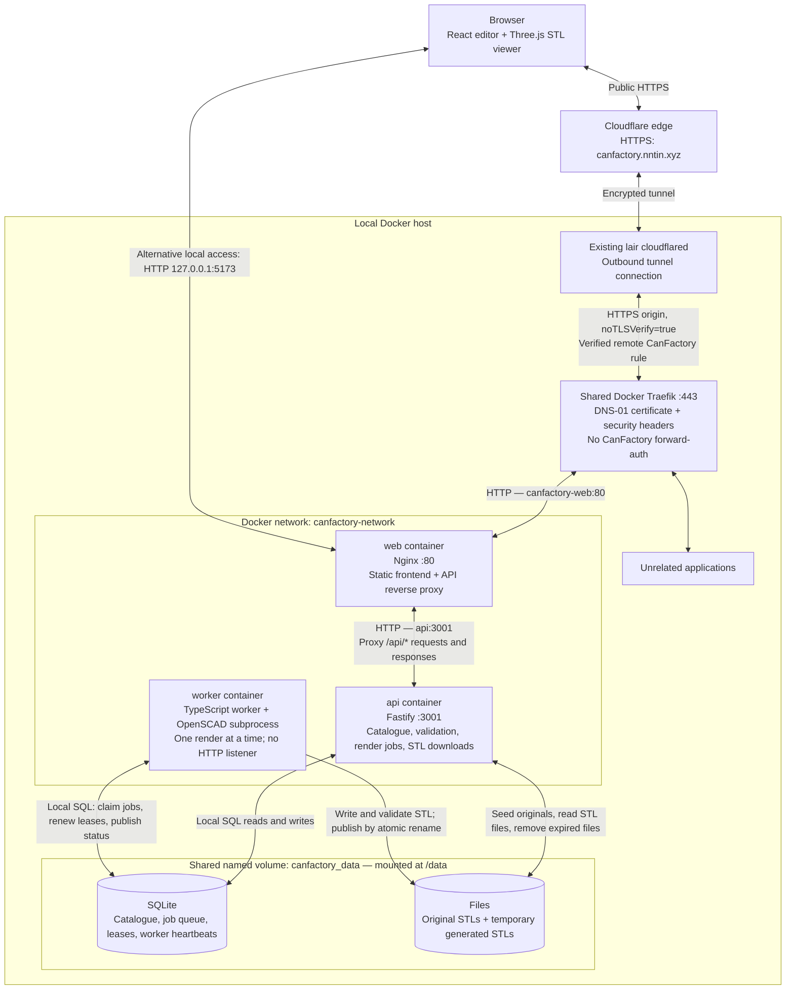
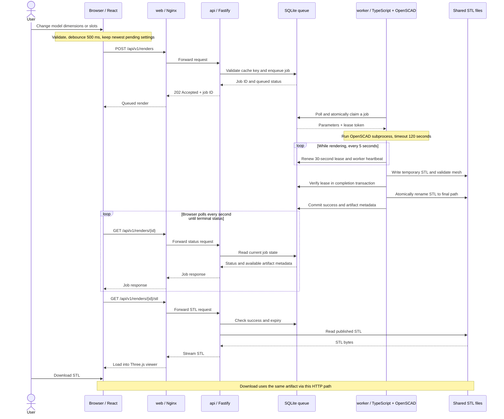
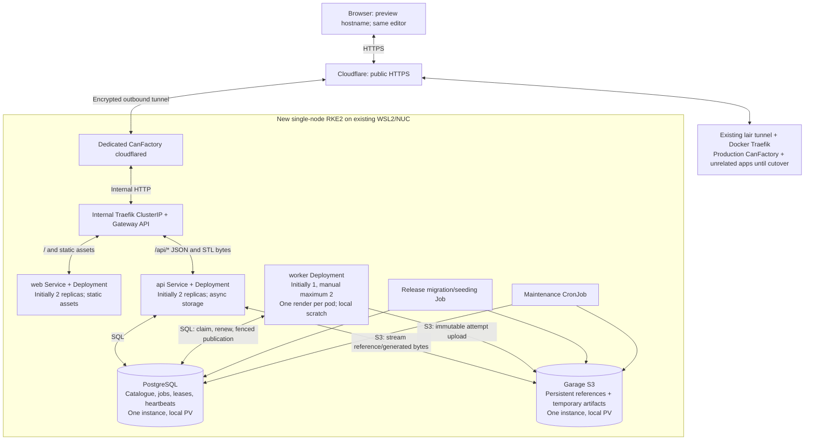

# Containers and communication

The first two diagrams describe the running Docker Compose application, including
the public route verified on 2026-09-21. The Kubernetes view describes the agreed
migration direction, with implementation details under review; it is not deployed.
Service names and ports match [compose.yaml](../compose.yaml).

## Current Docker containers



React and Three.js run in the browser; the web container serves their static
build. Only `web` publishes a host port. `api` listens inside the Docker network,
and `worker` has no listening port. OpenSCAD runs inside the worker container.

The API and worker communicate through shared SQLite state and files. There is
no API-to-worker HTTP call, message broker, or separate database container. Both
containers mount the same local volume. Trusted model definitions and SCAD
sources are packaged in their images, outside that writable volume.

| Connection | Purpose | Current protocol or access |
| --- | --- | --- |
| Browser ↔ Cloudflare ↔ cloudflared ↔ Traefik ↔ web | Public editor/API/STL access | Edge HTTPS, encrypted tunnel, origin HTTPS with verification disabled, then HTTP to web |
| Browser ↔ web | Alternative local editor/API/STL access | HTTP on localhost port 5173 (configurable with `WEB_PORT`) |
| web ↔ api | Forward every `/api/*` request and its response | HTTP to Docker service DNS `api:3001` |
| api ↔ SQLite | Catalogue, cached results, queued jobs, maintenance | SQLite file access on `/data`; no database TCP port |
| worker ↔ SQLite | Claim jobs, heartbeat, renew leases, record completion/failure | SQLite file access on the same volume |
| api ↔ files | Preserve originals, stream STL bytes, clean expired artifacts | Local filesystem on `/data` |
| worker → files | Render in a temporary directory, validate, publish artifact | Local filesystem on `/data` |

Compose starts `web` and `worker` after the API health check passes. This is a
startup dependency, not another communication channel. Nginx refreshes Docker
DNS so API address changes do not require a web restart.

## Render request and STL delivery

This sequence shows a cache miss. A matching unexpired successful render returns
immediately from the API without another OpenSCAD run.



Status polling overlaps rendering; it is drawn afterward to keep the sequence
readable. Failed renders return a terminal error without an artifact. Abandoned
leases allow one retry, while fencing tokens prevent stale workers from
publishing. The API refuses expired jobs/files; maintenance removes them.

## Kubernetes deployment — preview verified, production cutover pending

The user selected one WSL2/NUC host, RKE2, Flux, an application Helm chart,
PostgreSQL-backed jobs, local Garage, a dedicated tunnel, and independent manual
web/API/worker scaling. Short interruption and discarding old temporary renders
are acceptable. Detailed behavior is in the implemented [tech plan](kubernetes-tech-plan.md).



Preview and download still pass through the API and reference the same immutable
artifact. API reads enforce expiry regardless of object cleanup timing. There is
no worker HTTP Service or API-to-worker RPC. PostgreSQL is also the job queue;
no broker is introduced. Generated settings/files expire after one hour and
catalogue reference objects persist.

Both data services use network APIs even though their local volumes reside on
one node. Replicating application pods does not replicate these volumes or provide
availability after losing the NUC. Local copies support rollback; machine-loss
recovery rebuilds from Git/images and reseeds references with an empty render queue.

## Publication and failure boundaries

```mermaid
sequenceDiagram
    participant API
    participant DB as PostgreSQL
    participant Worker
    participant S3 as Garage
    API->>DB: Validate/fingerprint, deduplicate and enqueue transaction
    Worker->>DB: Atomic compatible claim + fencing token
    Note over Worker: Render/validate in local scratch; renew lease
    Worker->>S3: Upload immutable attempt object
    S3-->>Worker: Upload complete
    Worker->>DB: Publish metadata only with live token and unexpired job
    alt Winning live claim
        DB-->>Worker: Commit success
        API->>DB: Check success, expiry and object metadata
        API->>S3: Stream the recorded object for preview/download
    else Lost claim or failed commit
        Note over Worker,S3: Unreferenced upload is collected; stale result stays invisible
    end
```

There is no atomic transaction spanning PostgreSQL and Garage. The adapter must
handle upload/commit failures, durable deletion retries and abandoned uploads.
API processes no longer own migrations, seeding or cleanup. Release Jobs serialize
schema/catalogue changes; maintenance is independently coordinated. Fingerprint-
changing releases pause submissions and drain old work before catalogue activation.

Resource budgets, HTTP draining, lease recovery, immutable publication, expiry and
rolling upgrades have passed real multi-replica tests. The infrastructure repository
records exact evidence and remaining limits in `docs/canfactory/validation.md`.
The existing Compose deployment remains operational during implementation and
validation. Production DNS switching requires a separate cutover agreement.
