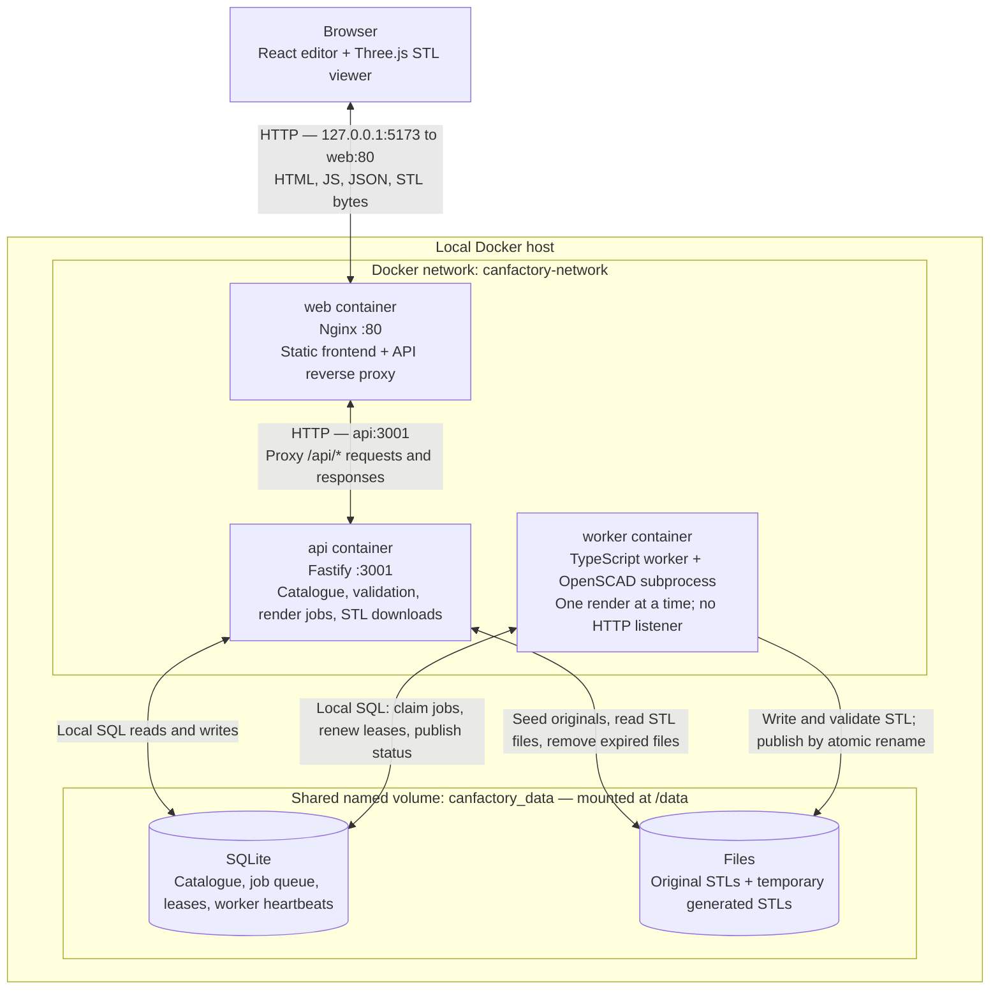
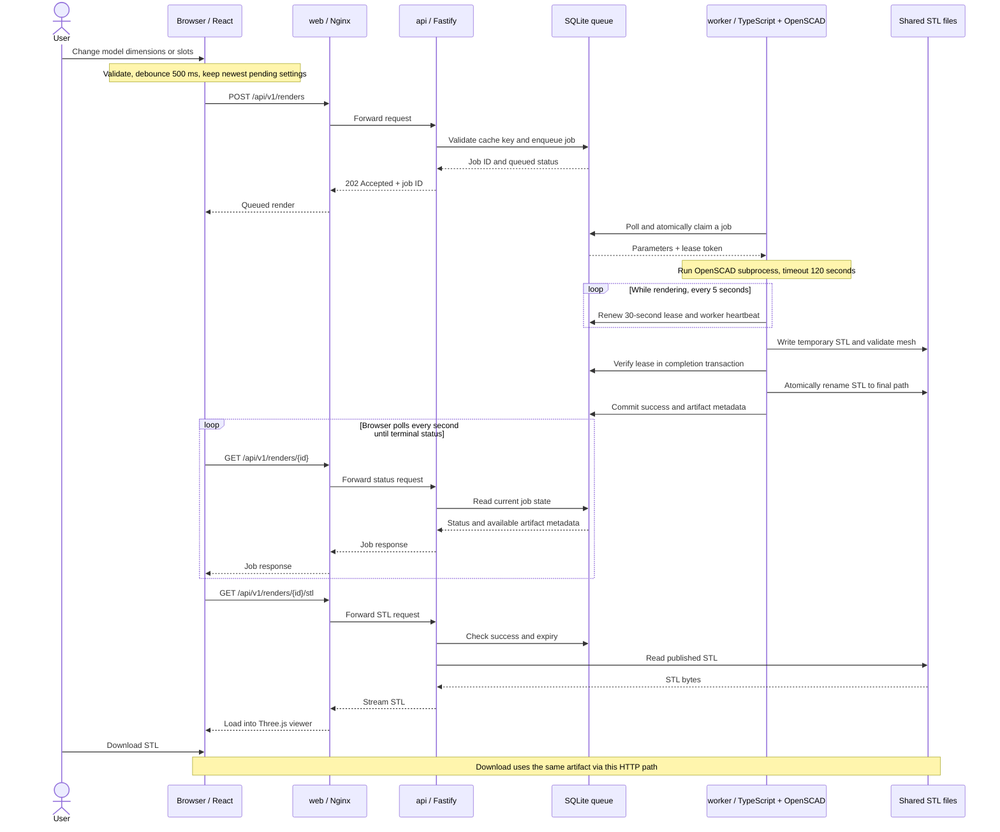
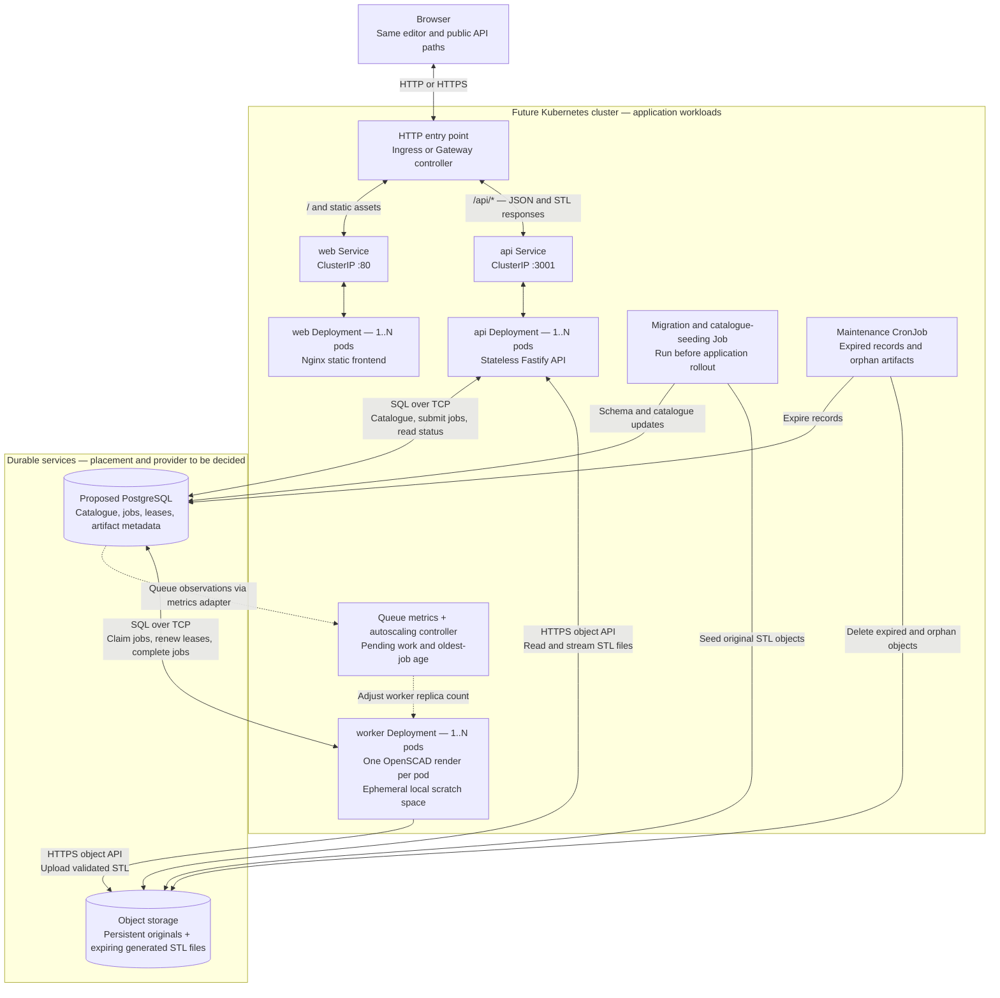

# Containers and communication

The first two diagrams describe the running Docker Compose application. The
Kubernetes view below describes a future target; it is not deployed today.
Service names and ports match [compose.yaml](../compose.yaml).

## Current Docker containers

React and Three.js run in the browser; the web container serves their static
build. Only `web` publishes a host port. `api` listens inside the Docker network,
and `worker` has no listening port. OpenSCAD runs inside the worker container.

The API and worker communicate through shared SQLite state and files. There is
no API-to-worker HTTP call, message broker, or separate database container. Both
containers mount the same local volume. Trusted model definitions and SCAD
sources are packaged in their images, outside that writable volume.

| Connection | Purpose | Current protocol or access |
| --- | --- | --- |
| Browser ↔ web | Load the editor; submit settings; poll; preview/download STL | HTTP on localhost port 5173 (configurable with `WEB_PORT`) |
| web ↔ api | Forward every `/api/*` request and its response | HTTP to Docker service DNS `api:3001` |
| api ↔ SQLite | Catalogue, cached results, queued jobs, maintenance | SQLite file access on `/data`; no database TCP port |
| worker ↔ SQLite | Claim jobs, heartbeat, renew leases, record completion/failure | SQLite file access on the same volume |
| api ↔ files | Preserve originals, stream STL bytes, clean expired artifacts | Local filesystem on `/data` |
| worker → files | Render in a temporary directory, validate, publish artifact | Local filesystem on `/data` |

Compose starts `web` and `worker` after the API health check passes. This is a
startup dependency, not another communication channel. Nginx refreshes Docker
DNS so API address changes do not require a web restart.

## Render request and STL delivery

This sequence shows a cache miss. A matching unexpired successful render returns
immediately from the API without another OpenSCAD run.

Status polling overlaps rendering; it is drawn afterward to keep the sequence
readable. Failed renders return a terminal error without an artifact. Abandoned
leases allow one retry, while fencing tokens prevent stale workers from
publishing. The API refuses expired jobs/files; maintenance removes them.

## Proposed Kubernetes target

This is a planning option, not an approved technology decision or an implemented
deployment. It uses PostgreSQL for both metadata and the render queue, and an
object store for STL files. Keeping queued work in the metadata database avoids
introducing a separate broker initially. Queue technology, storage provider,
cluster entry point, and replica limits remain architectural decisions.

Solid arrows show application traffic or storage access; dotted arrows show
observability and scaling control. Durable services may be managed externally
or operated in the cluster. They are drawn separately because replicating the
application pods does not replicate or scale the database and object store.

The entry point routes `/api/*` directly to the API Service in this proposal.
That removes the web container from the API traffic path; Nginx would serve only
static assets. STL bytes still travel through the API, preserving the current
expiry checks and same-origin viewer/download behavior. Direct object-store
downloads with short-lived URLs are a separate future optimization.

Each Deployment can have an independent replica count. Kubernetes Services
provide stable endpoints for the HTTP workloads. Workers pull jobs from the
queue and do not need an inbound application Service. These roles follow the
Kubernetes [Deployment](https://kubernetes.io/docs/concepts/workloads/controllers/deployment/)
and [Service](https://kubernetes.io/docs/concepts/services-networking/service/)
models.

## Scaling boundaries and migration work

| Component | Current constraint | Change before scaling across nodes |
| --- | --- | --- |
| web | One published localhost port; Nginx also proxies the API | Put replicas behind a Service and entry point; update routing and remove Docker-specific DNS configuration |
| api | SQLite and filesystem access; migrations, seeding, and cleanup run in each API process | Use networked storage adapters; run migrations/seeding once per rollout; coordinate maintenance independently of API replicas |
| worker | One render per process; shared local SQLite and artifact paths | Use a concurrent networked queue and object store; keep render scratch space local to each pod |
| Database / queue | SQLite is a file inside the Docker volume | Proposed PostgreSQL adapter with atomic claims, leases, deduplication, and fencing; size connection pools across all replicas |
| STL storage | Publication uses a filesystem rename into a shared directory | Upload to an immutable object key per attempt, then conditionally publish its metadata while holding the valid lease; collect abandoned uploads |
| Maintenance | API timer performs expiry and recovery; workers also recover leases | Make recovery safe under concurrent callers; use coordinated scheduled cleanup while enforcing expiry on every API read |

SQLite on a shared network filesystem is not the cross-node scaling path; its
locking and filesystem requirements need care over networks. See the
[SQLite network-storage guidance](https://www.sqlite.org/useovernet.html).

Preserve the existing worker contract during migration: only one live claim may
publish a result, retries must tolerate duplicate execution, and successful
metadata must reference a complete validated STL. Object upload and database
commit cannot share the current filesystem transaction; failed attempts must
leave only collectible, unreferenced objects. The current `Store` and
`ArtifactStore` still use synchronous SQLite/filesystem operations, so networked
adapters require asynchronous interfaces and changes at their call sites.

Scale the API using measured HTTP load and latency. Scale workers using queue
depth and waiting time, bounded by node CPU/memory and database capacity. Queue
metrics require an exporter/adapter and configured autoscaling; Kubernetes does
not infer queue demand from the database. Its
[Horizontal Pod Autoscaler](https://kubernetes.io/docs/concepts/workloads/autoscaling/horizontal-pod-autoscale/)
supports custom/external metrics with the appropriate metrics APIs installed.
The current two-CPU, 2 GB worker limit is a starting point for measurement, not
a proven Kubernetes resource allocation.

Before enabling multiple replicas, verify concurrent claims and cache
deduplication, pod termination during renders, abandoned-upload cleanup,
one-hour expiry, and a preview/download handled by different API replicas.
During rolling upgrades, API and worker model/renderer fingerprints must remain
compatible with queued jobs; drain old work or route jobs to compatible workers.
Kubernetes probes and shutdown handling also need explicit configuration;
Compose startup ordering does not become a Kubernetes rollout dependency.

The diagrams leave these decisions open: PostgreSQL queue versus a dedicated
broker, database/object-storage hosting, entry controller, autoscaling limits,
and whether the migrated installation remains local or becomes externally
accessible. See [architecture decisions](architecture.md) and
[interface contracts](interfaces.md) for the implemented behavior.
