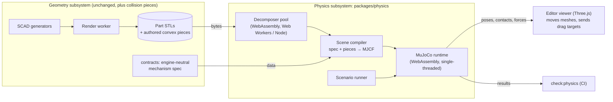

# Physics plan

How CanFactory simulates the motion of printed assemblies: joints, springs, gravity, contact (collision), and gear teeth.
It serves two goals with one engine:

- **CI tests.** `npm run check:physics` runs scripted scenarios on the rendered parts and checks their outcomes within
  tolerances, as `check:assembly` checks collisions.
- **Interactive use.** The editor's viewer gets an interactive mode in which the user drags the assembled parts freely and
  sees them move under gravity, springs, joints and contact.

This file is the plan agreed in issue can-48 (planning, 2026-10-09). The [status](#status) section at the end records what is
done. Read it again before continuing the work.

## Decisions

| Topic | Decision |
| --- | --- |
| Separation | Geometry generation and physics simulation are separate subsystems. Physics is the package `packages/physics`, running in its own browser Web Worker (interactive) or its own Node process (CI). No Kubernetes service is added. |
| Engine | [MuJoCo](https://mujoco.org), through its official WebAssembly build (`@mujoco/mujoco`, pinned to an exact version). The same `.wasm` runs in the browser and in Node, so CI tests what users get. |
| Threading | Single-threaded build. Revisit only if the frame rate demands it: the multithreaded build (`@mujoco/mujoco/mt`) needs `SharedArrayBuffer`, so the site would have to send COOP/COEP headers (Cloudflare, Traefik, and every cross-origin resource). A comment where the engine is loaded says so. |
| Model description | Generated MJCF XML. `mjSpec`'s web bindings are still marked untested. |
| Interaction | Free dragging: the viewer raycasts the picked part and sends a target; the worker applies MuJoCo's spring-damper perturbation (`MjvPerturb`), as MuJoCo's own viewer does. |
| When it builds | Only when the interactive mode is opened (and for each CI scenario). A parameter change while it is open makes the physics stale until it is rebuilt. |
| Joints | Ideal joints (hinge, slide, ball, fixed) by default. A joint may opt into **contact**: then the part's real pin and hole collide, with their clearance. |
| Collision geometry | In order of preference: (1) parts-library hardware as exact primitives from its dimensions; (2) convex pieces that the geometry side outputs (each gear tooth, cut at its root circle, and the hub); (3) convex decomposition of the part's STL, in the browser and in CI. |
| Decomposer | Spike both [V-HACD 4](https://github.com/kmammou/v-hacd) and [CoACD](https://github.com/SarahWeiii/CoACD) compiled to WebAssembly, evaluate, settle on one. |
| Gears | No gear constraint. Gears are hinges, coupled by the contact of their teeth. Tooth contact is required. |
| Materials | Per-material data (density, friction) is enough; print orientation is not modelled. Values come from cited primary sources. |
| Mobile | Nice to have and strongly encouraged; desktop first. |

## Why MuJoCo

The options compared in can-48 were Rapier, Jolt, PhysX (WebAssembly ports), Ammo.js, cannon-es, MuJoCo, Project Chrono,
Drake, Pinocchio and ODE. The interactive goal needs a browser build, which rules out Chrono, Drake, Pinocchio and ODE (and
streaming a server simulation at 60 Hz is a poor fit for the API/worker design). Of the WebAssembly engines, MuJoCo has
soft, tunable contact (stable at sub-millimetre clearances), built-in perturbation for dragging, first-party Node and browser
builds of the same code, and an Apache-2.0 licence. Its risks: the JavaScript bindings are marked work in progress, and it
collides meshes only as convex hulls (hence the decomposition).

## Architecture

- **Contracts** gain only engine-neutral data: the mechanism spec. Nothing in contracts knows MuJoCo.
- **`packages/physics`** depends on contracts (for the spec's types) but never on SCAD, OpenSCAD or the render pipeline. Its
  inputs are the spec and mesh bytes; its outputs are poses, contacts and forces.
- **The viewer** stays a viewer: in the interactive mode it shows the poses the worker posts each frame and forwards picks and
  drag targets. The physics runs in a dedicated Web Worker, never on the page's main thread.
- **CI** renders the parts as `check:assembly` does, then runs `packages/physics` in Node.

## Mechanism spec (contracts)

Implemented as `packages/contracts/src/physics.ts`; a model provides it as `ModelDefinition.physics(parameters)`.

A model's assembly may carry a `physics` section (engine-neutral; units mm, g, s, N, degrees):

- **bodies**: one per part or reference object (by its id in the assembly's poses), its **material** (density from
  `materials`), whether it is **fixed** (welded to the world), and optional overrides (mass, centre of mass).
- **joints**: between a body and its parent (or the world), each with a type (`hinge`, `slide`, `ball`, `free`, `weld`), an
  anchor and axis in the assembled frame, optional range, stiffness with a rest position (a spring), damping and dry friction
  (`frictionloss`, e.g. a snap's retention), and a **model**: `ideal` (default) or `contact`.
- **springs** from the parts library: a compression spring between two bodies takes its rate and lengths from the library entry.
- **collision**: per body, where its collision shape comes from: `primitive` (library hardware), `pieces` (authored convex
  pieces from the geometry side), or `decompose` (default), plus contact exclusions (pairs that never collide, e.g. bodies joined
  by an ideal joint).
- **scenarios**: named CI checks: initial poses, gravity direction, scripted drives (move a body or turn a joint along a
  timeline), duration, and assertions (a body's position, angle or contact state within a tolerance at a given time).

The spec is TypeBox, like the rest of contracts, and validated by tests that compare it with the SCAD files where values come
from them (as `toggleLatchMechanism.ts` does).

Materials (`PHYSICS_MATERIALS`) carry each value's source and what was read there. No published figure was found for printed
plastic sliding on printed plastic; the nearest is printed PETG and PLA sliding on acrylic (0.28–0.30, natural surfaces), which
is used for both. Printed parts are taken as solid; a body whose real mass is known (the lighter, 13 g) gives it.

## Collision geometry

1. **Primitives.** Balls, pins, screws, magnets and other parts-library hardware become MuJoCo spheres, cylinders, capsules
   and boxes from their dimensions. The detent's ball is an exact sphere.
2. **Authored pieces.** A part may output its own convex pieces: the geometry side renders a collision variant of the part (a
   SCAD define) in which every piece is its own solid, and physics uses them instead of decomposing. Gears output each tooth,
   cut at the root circle, and the hub. Physics checks each piece is convex (its hull's volume matches its own). The transport
   format (one file per piece, OpenSCAD's lazy-union 3MF, or slightly separated solids split into connected components) is
   settled in spike 4. The pieces are requested through the existing render queue when the interactive mode opens, so
   producing them stays the geometry subsystem's job.
3. **Decomposition.** Everything else is decomposed into convex pieces by the chosen decomposer, compiled to WebAssembly, with a
   fixed seed so that the browser and CI get the same pieces. Each part decomposes in its own Web Worker (no shared memory
   needed). Results are cached in the browser (IndexedDB) by STL hash, decomposer settings and decomposer version; the cache is
   only a speed-up.

## Units and scale

MuJoCo has no units. The scene compiler converts the spec's millimetres to **metres** and grams to **kilograms**, so that
gravity is 9.81 and forces are in newtons. Clearances of 0.1 mm become 1e-4 m, so the time step, contact margin and soft
contact parameters (`solref`, `solimp`) are tuned for that scale.

Spike 1 measured how far small parts sink into a floor at rest (`DEFAULT_OPTIONS` in `packages/physics/src/scene.ts`):

| Time step | `solref` | `solimp` | 10 g box, 20 mm | 4.5 mm steel ball | Cost per simulated second |
| --- | --- | --- | --- | --- | --- |
| 2 ms (MuJoCo's default) | 0.02 1 | 0.9 0.95 0.001 | 108 µm | 367 µm | 43 ms |
| 0.5 ms | 0.002 1 | 0.9 0.95 0.001 | 1.1 µm | 4.4 µm | 51 ms |
| **0.5 ms (chosen)** | **0.002 1** | **0.99 0.999 0.0001** | **0.10 µm** | **0.40 µm** | **31 ms** |
| 0.2 ms | 0.001 1 | 0.99 0.999 0.0001 | 0.02 µm | 0.10 µm | 81 ms |

MuJoCo's defaults let parts sink as far as the models' clearances, so they cannot be used. The chosen row keeps contact well
under a micron and still runs about 30 times faster than real time on this host (Node, single-threaded).

## Quasi-static

The engine's contacts are soft: a part striking another is stopped over about its speed times the contact time constant (2 ms).
A 0.4 g steel ball let go 0.8 mm into its 4.6 N/mm spring reaches about 3 m/s and passed millimetres into, and through, the
printed lip. So the physics is quasi-static: printed mechanisms are judged at rest and in slow motion.

- A sprung joint is damped to a 50 ms time constant (`QUASI_STATIC` in contracts: damping = stiffness × 0.05).
- The physics side adds inertia (MuJoCo's armature) to every sprung or damped joint (`jointArmature` in build.ts): at least 10 Δt c,
  because MuJoCo integrates joint damping implicitly and that dilutes the contact forces on a light body by its mass over its mass
  plus Δt c (the damped ball crept through its lip without it); and at least k (Δt / 0.2)², so that a spring's oscillation takes
  30 steps or more.

Neither changes anything at rest, which is what the scenarios check; both slow the motion. Setting a joint's position before each
step does not hold it either (the spring moves it within the step): joint drives are constraints (below).

## Determinism

The same pinned `.wasm` runs in Node and the browser, single-threaded. A test runs a reference scene in Node
(`referenceScene.ts`: a mesh cube, a steel ball, a sprung hinge and a slide with dry friction) and compares a hash of the state
after 2000 steps with a recorded value. CI assertions use tolerances rather than exact values, so a later
engine upgrade only needs the recorded hash renewed, not every scenario.

## Test cases

| Case | Bodies and joints | What CI checks |
| --- | --- | --- |
| Cigarette case: lighter in the round bay | Case box fixed; lighter free; holder on a slide with dry friction for its snap | Upright, the lighter comes to rest on the tab and the holder stays. Upside down, pushing the lighter in pushes the holder out through the floor (about 5.2 mm, see [cigarette-case-assembly.md](cigarette-case-assembly.md#upside-down-the-push-out)). |
| Spring-ball detent | Body fixed; ball (sphere) on a slide, with the library spring's rate and installed length | The ball rests on the lip with the installed preload; pushed in by the travel, the force matches the spring's rate. |
| Toggle latch | Base fixed; lever, link and catch on ideal hinges and a slide from `toggleLatchMechanism.ts`; optional contact pins | Driving the lever reproduces `TOGGLE_LATCH_HOOKED` within tolerance; closed and pulled, the lever stays closed (over centre). |
| Gears (later) | Hinges on the axes; authored tooth pieces | Turning one gear turns the other at the tooth ratio; backlash matches the geometry. |

## Engine notes

- `@mujoco/mujoco` is pinned to 3.14.0. Its typings return `any` for arrays, so `packages/physics/src/engine.ts` narrows the part
  of the API the package uses; nothing else touches the bindings.
- Reading `MjData.eq_active` throws a binding error in 3.14.0, so equality constraints cannot be switched on and off at run time.
  Dragging therefore applies a spring force (`xfrc_applied`) instead of a mocap body on a switchable constraint, the same way as
  MuJoCo's own `mjv_applyPerturbForce`, with the point's velocity from `mj_objectVelocity`.
- A scenario's push is a fingertip: a 1 mm sphere on a mocap body, moved along the timeline and taken away when it lets go. A
  spring on the pushed point, scaled to the body's mass like the pointer's drag, was far too weak for a 0.4 g ball on a 12 N
  spring, and an explicit spring stiff enough would be unstable.
- Joint drives (scenarios) are joint equality constraints whose target the simulation moves (`eq_data`), with a 1 ms time
  constant and impedance 0.9999: MuJoCo scales a constraint's stiffness by the body's mass, so a light part on a stiff spring
  pulls a softer one off its target (a 0.4 g ball on 2 N/mm gave way 0.09 mm). Setting the joint's position before each step
  does not hold it: the spring moves it within the step.
- The integrator is `implicitfast`, so that joint springs and damping are integrated implicitly.
- Whether two bodies touch is measured with `mj_geomDistance` (within 10 µm), not from the contact list, which only holds pairs
  that already overlap. A contact margin and gap would report near pairs too, but they changed where parts rest by 20 µm.
- Dry joint friction (`frictionloss`) is a soft constraint as well: with MuJoCo's defaults a holder held by 2 N crept down
  under its own 0.02 N weight at 10 mm/s. Its `solreffriction` is the contacts' and its `solimpfriction` 0.9999, which stops it.
- `DoubleBuffer` is constructed with its size (`new DoubleBuffer(n)`), not with an array as the package's README shows.

## Test case results

`npm run check:physics` (all with given pieces; see below why):

| Model | Scenario | Result |
| --- | --- | --- |
| Spring-ball detent | Rests on the lip | 6 µm under the lip, touching it |
| | Upside down | still on the lip |
| | Pushed in by the travel | the spring pushes back 16.400 N (layout: 16.4 N) |
| | Pushed in flush, let go | back on the lip |
| Toggle latch | Closed, pulled with 10 N | lever and catch stay put (over-centre lock) |
| | Lever turned to dead centre against the pull | catch drawn in 0.322 mm (table: 0.32) |
| | Lever opened to 60° | catch let go 1.249 mm (table: 1.25) |
| Cigarette case | Upright | the lighter rests on the tab, 2.4 mm clear of the holder |
| | Turned over about X (wheel side to the tab) | its hood pushes the holder out about 5.5 mm until its lever lands on the tab (documented: 5.2 mm; the hood is solid between its thumb rings here and the lighter settles 0.25 mm sideways, so the window is ±0.5 mm) |
| | Turned over about Y (front end to the tab) | it lands on the tab; the holder stays |
| | Case upside down | the holder's fit keeps it in |

The holder's fit is an assumption (2 N; `HOLDER_HOLD`): how firmly a printed friction fit holds is not known without printing.
Each mechanism lives next to its geometry in contracts: `springBallDetentPhysics` (models.ts), `toggleLatchPhysics`
(toggleLatchMechanism.ts) and `cigaretteCasePhysics` (cigaretteCasePhysics.ts, whose SCAD values a test keeps equal).

## Interactive mode

The editor's viewer has a **Simulate** button (an atom) for every model with a mechanism, once its parts have loaded. It opens
the physics bar in place of the assembly slider:

- `apps/web/src/physicsWorker.ts` is the Web Worker. It loads MuJoCo (the single-threaded build; the `.wasm` is 10.3 MB, 2.6 MB
  gzipped, fetched only when the mode opens) and runs an `InteractiveSession` (`packages/physics/src/interactive.ts`), posting the
  bodies' poses about 60 times a second. A slow device runs in slow motion rather than falling behind (at most 50 ms of
  simulation per tick).
- The viewer sends the meshes it already shows; bodies without given pieces are decomposed in the worker with V-HACD and cached
  in IndexedDB.
- Dragging: the pointer takes a part by the point it hits (the cursor shows a hand over a part, and the camera stops orbiting).
  The point is pulled on a plane facing the camera by the drag spring; for a jointed part, that spring is for the mass the pull
  moves, the part's own plus its joint's armature over the squared lever arm.
- **Upright / Upside down** turns gravity over; **Restart** starts again from the mechanism's poses. Closing the mode puts the
  slider's poses back.
- For the page's tests the viewer reports `data-physics` (starting, running, error), `data-physics-time`, and every tenth frame
  `data-physics-poses` and `data-physics-screen` (each body's centre on the screen).

Checked in Chromium (software WebGL): the toggle latch starts closed, its lever swings open when dragged, and the reference
scene's state hash is the same as in Node.

## Spike 2: decomposition is not enough

The decomposers were compiled to WebAssembly (`packages/physics/decomposers/build.sh`: pinned commits, Emscripten 4.0.10, one
single-file ES module each: V-HACD 200 KB, CoACD 955 KB; CoACD without its OpenVDB preprocessing, which the rendered closed meshes
do not need). `tools/physics/decomposers.ts` runs them on the test parts and measures each result with `pieceFit`: how deep the
pieces reach out of the part into free space (where they stop another part short) and how far the part's surface lies outside
them.

| Part | Triangles | Decomposer | Time | Pieces | Deepest intrusion | 99 % intrusion | Widest gap |
| --- | --- | --- | --- | --- | --- | --- | --- |
| BIC Mini lighter | 5042 | V-HACD, defaults | 4.6 s | 64 | 1.946 mm | 0.857 mm | 0.323 mm |
| BIC Mini lighter | 5042 | V-HACD, 2M voxels, 128 hulls | 15.1 s | 128 | 1.285 mm | 0.473 mm | 0.190 mm |
| BIC Mini lighter | 5042 | CoACD, defaults | 37.8 s | 22 | (pending) | | |

The models are built with 0.1 to 0.3 mm clearances. On the detent, V-HACD's pieces filled the bore and the lip, and the ball was
shoved 2.8 mm down the bore before anything else happened. A generic decomposition is good enough for the outside of a part, but
not for the surfaces a mechanism slides on. So the geometry side gives exact convex pieces for those
(`packages/contracts/src/physicsPieces.ts`): a part revolved or extruded from a 2D profile in its SCAD file has the same profile
split into convex polygons (ear clipping, then merging across shared edges while convex) and each revolved in thin segments
or extruded. The detent's body is 96 such pieces, whose chords lie at most 0.005 mm off the bore. With them every detent
scenario passes: the ball rests 6 µm under the lip, and pushed in flush the spring holds 16.400 N, as the layout gives.

## Spikes

| # | Spike | Pass criterion |
| --- | --- | --- |
| 1 | MuJoCo WebAssembly in Node and in a browser Web Worker on a reference scene | The same state hash after N steps; units and time step chosen for 0.1 mm clearances |
| 2 | V-HACD 4 and CoACD compiled to WebAssembly, run on the lighter, the detent's body and a latch part | Runtime (desktop, phone), piece count, worst gap error, identical output in browser and Node; choose one |
| 3 | The three test cases, ideal joints; the latch also with contact pins | The checks in [Test cases](#test-cases) |
| 4 | A printed spur-gear pair with authored tooth pieces | Ratio and backlash match the geometry; transport format settled |
| 5 | Free dragging in the editor viewer | Smooth at 60 fps on a desktop; note behaviour on a phone |

## Status

| Step | State |
| --- | --- |
| Plan (this file) | Done |
| `packages/physics` skeleton, MuJoCo loading in Node | Done: `engine.ts` (typed facade), `scene.ts`, `mjcf.ts`, `massProperties.ts`, `simulation.ts` (drag spring, state hash) |
| Spike 1: reference scene, determinism hash | Done: Node and Chromium give the same hash, `8f74ba0ac93ddcdf` (@mujoco/mujoco 3.14.0) |
| Mechanism spec in contracts | Done: `packages/contracts/src/physics.ts` (`PhysicsSpec`, `ModelDefinition.physics`, cited `PHYSICS_MATERIALS`) |
| Scene compiler (spec → MJCF) | Done: `build.ts` (spec + poses + geometry → SI scene), `mjcf.ts`; scenario runner `scenario.ts` |
| Spike 2: decomposers | Both built and measured; given pieces for mechanism surfaces (above); choice between V-HACD and CoACD for the rest pending CoACD's numbers |
| Spike 3: test cases, `check:physics` | Done: all 11 scenarios of the three test cases pass (see [Test cases](#test-cases)) |
| Spike 4: gears | Not started |
| Spike 5: interactive mode | Done: the editor viewer's Simulate mode (see [Interactive mode](#interactive-mode)); `tests/browser/physics.spec.ts` drags the toggle latch's lever open |
