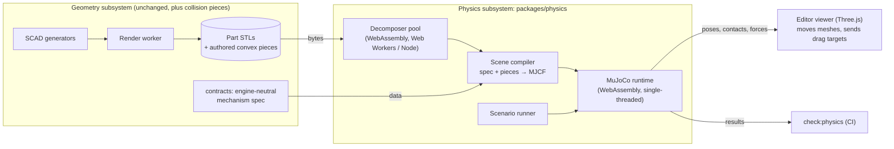

# Physics plan

How CanFactory simulates the motion of printed assemblies: joints, springs, gravity, contact (collision), and gear teeth.
It serves two goals with one engine:

- **CI tests.** `npm run check:physics` runs scripted scenarios on the rendered parts and checks their outcomes within
  tolerances, as `check:assembly` checks collisions.
- **Interactive use.** The editor's viewer gets an interactive mode in which the user drags the assembled parts freely and
  sees them move under gravity, springs, joints and contact.

This file is the plan agreed in issue can-48 (planning, 2026-10-09). The [status](#status) section at the end records what is
done. Read it again before continuing the work.

## Decisions

| Topic | Decision |
| --- | --- |
| Separation | Geometry generation and physics simulation are separate subsystems. Physics is the package `packages/physics`, running in its own browser Web Worker (interactive) or its own Node process (CI). No Kubernetes service is added. |
| Engine | [MuJoCo](https://mujoco.org), through its official WebAssembly build (`@mujoco/mujoco`, pinned to an exact version). The same `.wasm` runs in the browser and in Node, so CI tests what users get. |
| Threading | Single-threaded build. Revisit only if the frame rate demands it: the multithreaded build (`@mujoco/mujoco/mt`) needs `SharedArrayBuffer`, so the site would have to send COOP/COEP headers (Cloudflare, Traefik, and every cross-origin resource). A comment where the engine is loaded says so. |
| Model description | Generated MJCF XML. `mjSpec`'s web bindings are still marked untested. |
| Interaction | Free dragging: the viewer raycasts the picked part and sends a target; the worker applies MuJoCo's spring-damper perturbation (`MjvPerturb`), as MuJoCo's own viewer does. |
| When it builds | Only when the interactive mode is opened (and for each CI scenario). A parameter change while it is open makes the physics stale until it is rebuilt. |
| Joints | Ideal joints (hinge, slide, ball, fixed) by default. A joint may opt into **contact**: then the part's real pin and hole collide, with their clearance. |
| Collision geometry | In order of preference: (1) parts-library hardware as exact primitives from its dimensions; (2) convex pieces that the geometry side outputs (each gear tooth, cut at its root circle, and the hub); (3) convex decomposition of the part's STL, in the browser and in CI. |
| Decomposer | Spike both [V-HACD 4](https://github.com/kmammou/v-hacd) and [CoACD](https://github.com/SarahWeiii/CoACD) compiled to WebAssembly, evaluate, settle on one. |
| Gears | No gear constraint. Gears are hinges, coupled by the contact of their teeth. Tooth contact is required. |
| Materials | Per-material data (density, friction) is enough; print orientation is not modelled. Values come from cited primary sources. |
| Mobile | Nice to have and strongly encouraged; desktop first. |

## Why MuJoCo

The options compared in can-48 were Rapier, Jolt, PhysX (WebAssembly ports), Ammo.js, cannon-es, MuJoCo, Project Chrono,
Drake, Pinocchio and ODE. The interactive goal needs a browser build, which rules out Chrono, Drake, Pinocchio and ODE (and
streaming a server simulation at 60 Hz is a poor fit for the API/worker design). Of the WebAssembly engines, MuJoCo has
soft, tunable contact (stable at sub-millimetre clearances), built-in perturbation for dragging, first-party Node and browser
builds of the same code, and an Apache-2.0 licence. Its risks: the JavaScript bindings are marked work in progress, and it
collides meshes only as convex hulls (hence the decomposition).

## Architecture

- **Contracts** gain only engine-neutral data: the mechanism spec. Nothing in contracts knows MuJoCo.
- **`packages/physics`** depends on contracts (for the spec's types) but never on SCAD, OpenSCAD or the render pipeline. Its
  inputs are the spec and mesh bytes; its outputs are poses, contacts and forces.
- **The viewer** stays a viewer: in the interactive mode it shows the poses the worker posts each frame and forwards picks and
  drag targets. The physics runs in a dedicated Web Worker, never on the page's main thread.
- **CI** renders the parts as `check:assembly` does, then runs `packages/physics` in Node.

## Mechanism spec (contracts)

A model's assembly may carry a `physics` section (engine-neutral; units mm, g, s, N, degrees):

- **bodies**: one per part or reference object (by its id in the assembly's poses), its **material** (density from
  `materials`), whether it is **fixed** (welded to the world), and optional overrides (mass, centre of mass).
- **joints**: between a body and its parent (or the world), each with a type (`hinge`, `slide`, `ball`, `free`, `weld`), an
  anchor and axis in the assembled frame, optional range, stiffness with a rest position (a spring), damping and dry friction
  (`frictionloss`, e.g. a snap's retention), and a **model**: `ideal` (default) or `contact`.
- **springs** from the parts library: a compression spring between two bodies takes its rate and lengths from the library entry.
- **collision**: per body, where its collision shape comes from: `primitive` (library hardware), `pieces` (authored convex
  pieces from the geometry side), or `decompose` (default), plus contact exclusions (pairs that never collide, e.g. bodies joined
  by an ideal joint).
- **scenarios**: named CI checks: initial poses, gravity direction, scripted drives (move a body or turn a joint along a
  timeline), duration, and assertions (a body's position, angle or contact state within a tolerance at a given time).

The spec is TypeBox, like the rest of contracts, and validated by tests that compare it with the SCAD files where values come
from them (as `toggleLatchMechanism.ts` does).

## Collision geometry

1. **Primitives.** Balls, pins, screws, magnets and other parts-library hardware become MuJoCo spheres, cylinders, capsules
   and boxes from their dimensions. The detent's ball is an exact sphere.
2. **Authored pieces.** A part may output its own convex pieces: the geometry side renders a collision variant of the part (a
   SCAD define) in which every piece is its own solid, and physics uses them instead of decomposing. Gears output each tooth,
   cut at the root circle, and the hub. Physics checks each piece is convex (its hull's volume matches its own). The transport
   format (one file per piece, OpenSCAD's lazy-union 3MF, or slightly separated solids split into connected components) is
   settled in spike 4. The pieces are requested through the existing render queue when the interactive mode opens, so
   producing them stays the geometry subsystem's job.
3. **Decomposition.** Everything else is decomposed into convex pieces by the chosen decomposer, compiled to WebAssembly, with a
   fixed seed so that the browser and CI get the same pieces. Each part decomposes in its own Web Worker (no shared memory
   needed). Results are cached in the browser (IndexedDB) by STL hash, decomposer settings and decomposer version; the cache is
   only a speed-up.

## Units and scale

MuJoCo has no units. The scene compiler converts the spec's millimetres to **metres** and grams to **kilograms**, so that
gravity is 9.81 and forces are in newtons. Clearances of 0.1 mm become 1e-4 m, so the time step, contact margin and soft
contact parameters (`solref`, `solimp`) are tuned for that scale; spike 1 and spike 3 establish them and record them here.

## Determinism

The same pinned `.wasm` runs in Node and the browser, single-threaded. A test runs a reference scene in Node and compares a
hash of the state after N steps with a recorded value. CI assertions use tolerances rather than exact values, so a later
engine upgrade only needs the recorded hash renewed, not every scenario.

## Test cases

| Case | Bodies and joints | What CI checks |
| --- | --- | --- |
| Cigarette case: lighter in the round bay | Case box fixed; lighter free; holder on a slide with dry friction for its snap | Upright, the lighter comes to rest on the tab and the holder stays. Upside down, pushing the lighter in pushes the holder out through the floor (about 5.2 mm, see [cigarette-case-assembly.md](cigarette-case-assembly.md#upside-down-the-push-out)). |
| Spring-ball detent | Body fixed; ball (sphere) on a slide, with the library spring's rate and installed length | The ball rests on the lip with the installed preload; pushed in by the travel, the force matches the spring's rate. |
| Toggle latch | Base fixed; lever, link and catch on ideal hinges and a slide from `toggleLatchMechanism.ts`; optional contact pins | Driving the lever reproduces `TOGGLE_LATCH_HOOKED` within tolerance; closed and pulled, the lever stays closed (over centre). |
| Gears (later) | Hinges on the axes; authored tooth pieces | Turning one gear turns the other at the tooth ratio; backlash matches the geometry. |

## Spikes

| # | Spike | Pass criterion |
| --- | --- | --- |
| 1 | MuJoCo WebAssembly in Node and in a browser Web Worker on a reference scene | The same state hash after N steps; units and time step chosen for 0.1 mm clearances |
| 2 | V-HACD 4 and CoACD compiled to WebAssembly, run on the lighter, the detent's body and a latch part | Runtime (desktop, phone), piece count, worst gap error, identical output in browser and Node; choose one |
| 3 | The three test cases, ideal joints; the latch also with contact pins | The checks in [Test cases](#test-cases) |
| 4 | A printed spur-gear pair with authored tooth pieces | Ratio and backlash match the geometry; transport format settled |
| 5 | Free dragging in the editor viewer | Smooth at 60 fps on a desktop; note behaviour on a phone |

## Status

| Step | State |
| --- | --- |
| Plan (this file) | Done |
| `packages/physics` skeleton, MuJoCo loading in Node | Not started |
| Spike 1: reference scene, determinism hash | Not started |
| Mechanism spec in contracts | Not started |
| Scene compiler (spec → MJCF) | Not started |
| Spike 2: decomposers | Not started |
| Spike 3: test cases, `check:physics` | Not started |
| Spike 4: gears | Not started |
| Spike 5: interactive mode | Not started |
